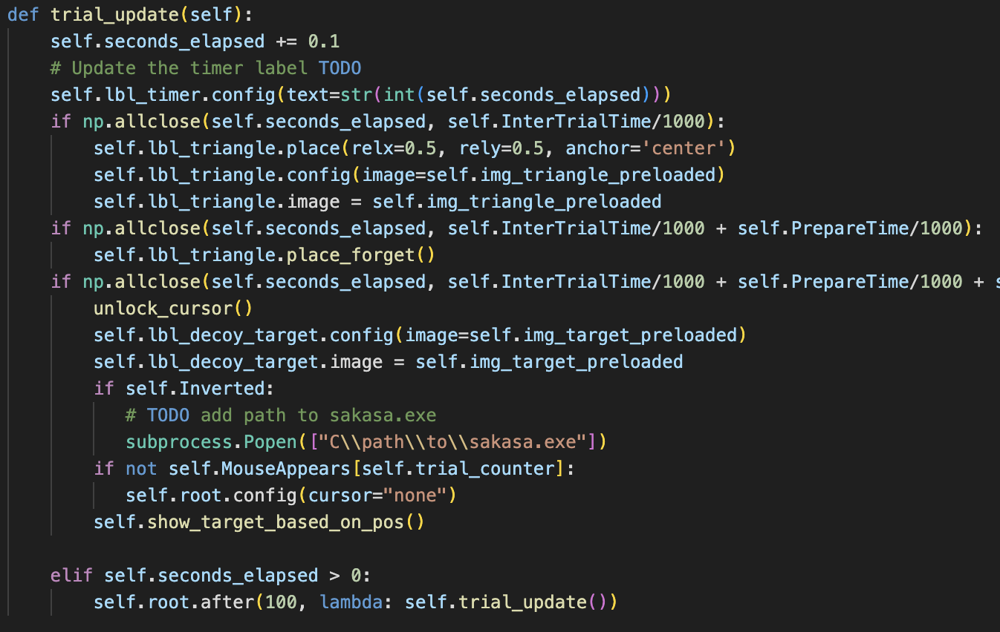

# 🌊 Flow Task v1.0.1

The Flow Task is an application tailored to assess variations in response efficiency across distinct subject groups. The cohorts being analyzed comprise seasoned contemplative practitioners, expert first-person shooter gamers, and a control group. 
This task was chiefly designed by [someone]() in collaboration with [others]().

---
---

## 1. Description

The task is based around a mouse task that requires the subject to reach the displayed target from a starting point at the bottom center of the screen. Options for separating subject performance include:
- Cursor disappearing
- Target moving after horizontal trigger is reached
- Time intervals between various events (e.g,. preparation time)
- And more...

---
---

## 2. Getting Started
---

### 2.1 Supported Operating Systems

* All functionalities have been tested on Windows 10
* A verison for Mac will be made possible without the mouse blocking at the starting block.

---

### 2.2 Installing Working Environment 

* We recommend using a conda environement for installing the necessary dependencies to run the applicaton. Alternatively, you might want to opt for **virtualenv**. Here's how it can be done:
  - Install the package with [pip](https://www.geeksforgeeks.org/how-to-install-pip-on-windows/#:~:text=Step%201%3A%20Download%20the%20get,where%20the%20above%20file%20exists.&text=Step%204%3A%20Now%20wait%20through,Voila!) and create an evironment:
    ```
    pip install virtualenv
    ```
    ```
    virtualenv venv_name
    ```
  - Acitivate the virtual environment:
    - On Windows:
        ```
        .\venv_name\Scripts\activate
        ```
    - On MacOS and Linux:
        ```
        source venv_name/bin/activate
        ```
  - Once the virtual environment activated, you can install all the necessary dependencies using:
    ```
    pip install -r requirements.txt
    ```
  - Once done using the application, deactivate the virtual environment with:
    ```
    deactivate
    ```

---

### 2.3 Executing program

* After installing the necessary dependencies, execute the program by moving to your directory containing the main.py file and run:
    ```
    python main.py
    ```
* Note that the application window may not directly open in full screen depending on whether the window from which you entered the above command was itself fullscreen mode. Be sure to set the application window in full screen mode before pressing the <strong>Start</strong> button. Not doing so will result in a messy layout (*you'll notice if this happens*).
    <div style="border:2px solid black; padding:10px; margin:10px 0; background-color:#F55187;">
        ⚠️ <strong>ATTENTION:</strong> Be sure to set the application window in full screen mode before pressing the <strong>Start</strong> button.
    </div>

---

### 2.4 Key Actions during program execution

* If you want to stop the application before the end of the series of trials press the **escape** key and close the application window.
* Alternatively, if you started the trials (i.e., you pressed the **start** button), pressing the **enter** key will restart the main application window. 
* During any one trial, between the time when the trigger is crossed, and the *time_to_center_of_target* after the user has first entered the target, pressing the **space** key will enable to move on to the subsequent trial.

---

### 2.5 Program Configuration Options
We present here a brief desciption of what each parameter controls for in the Flow Task. These parameters can be adjusted in the **Settings** window when launching the application.
- **Number of questions**: Controls the number of questions that can be asked when the task is running. Questions can appear to the user either before a trial begins or immediately at the end of a trial ('pre' and 'post' options). For each question the formulation of the question, the range of possible answers (between 1 and number another natural number between 2 and 9) and the timing as described previously. 
- **Trigger Visible**: Boolean parameter to make trigger visible for al trials.
- **Configure csv manually**: 
  - If set to true, the user must manually populate the [trial_by_trial_config.csv](Configurations/trial_by_trial_config.csv). Be careful to set the number of complete rows in the csv file in accordance with the Number of Random Trials chosen in the **Settings** window.
    1. First column: (int) Sets the position of the target for each trial. Accepted values are 0, 1, 2 (left, center, right respectively)
    2. Second column: (int) Determines whether the mouse is visible or not for a given trial.
    3. Third column: (float) Determines where the trigger (horizontal bar) lies. Accepted values are between 0.0 and 100.0 (percentage of the screen height with 100% referring to the top of the screen).
    4. Fourth column: (int) Time in (ms) sets the time between when yellow triangle disappears and when the target appears. 
  - If set to false, the user must choose the frequency at which the mouse should appear across trials, the number of different trigger positions (with corresponding values) and the number of different time intervals between the disappearance of the yellow triangle and the appearance of the target (with corresponding values again). These parameters can be readily selected through the the **Settings** window. The [trial_by_trial_config.csv](Configurations/trial_by_trial_config.csv) file is then automatically generated assuming the following: 
    - the target will be on the left or on the right with probability 45% each (and a probability of 10% of staying in the middle)
    - mouse appears at the given frequency
    - trigger position values are sampled with the same probability
    - time interval values are sampled with the same probability
- **Trajectory sampling rate**: Sampling rate for the trajectory recording. The recording starts when the target first appears (decoy target always placed at the center of the screen) and ends at the end of the trial. Both a .png file of the mouse trajectory and a .csv file with the mouse coordinates are recorded for each trial and can be found in the [Output/Trajectories](Output/Trajectories).
- **Preparation time before triangle appears**: Time in (ms) before the triangle appears (after the mouse was brought back to the starting block automatically).
- **Delay between trials**: Time in (ms) between each trial (seen as the time between when the pre-trial question window and the post-trial question window appear).
- **Time to Center of target**: Time in (ms) between when the mouse first enters the target and the end of the trial (can also be signaled by pressing the **space** key).
- **Triangle time**: Time in (ms) for which the yellow triangle is displayed.
- **Number of Random Trials**: Number of trials for one task.
- **Target Size**: Adjust the size of the target to your liking.


---

### 2.6 Mouse Inversion Option (Windows users)
- To have access to the mouse inversion option, download [sakasa mouse](https://www.filepuma.com/download/sakasa_mouse_1.03-6527/). 
- Once downloaded, add the path to the executable sakasa.exe in the trial_update method in the [Start.py](Start.py) file as shown below:


---
---

## 3. Help

If any help is needed, I'll be happy to lend a hand at abelrasssat@gmail.com.

---
---

## 4. Authors

--

---
---

## 5. Version History

* 0.1
    * Initial Release

---
---

## 6. License

--

---
---

## 7. Acknowledgments

-- 